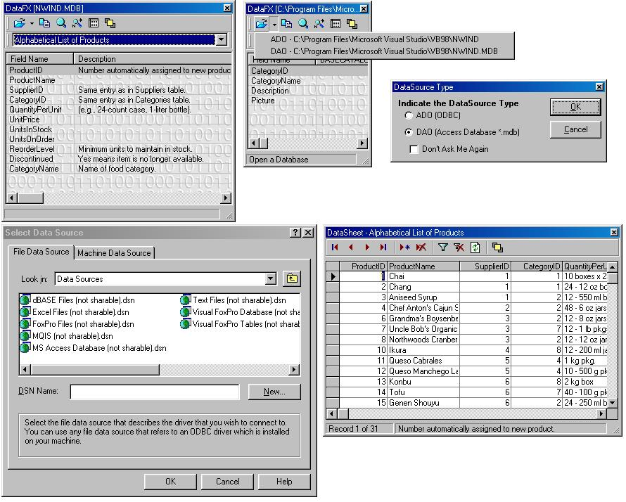



## DataFX2 \(ADO Version\!\!\!\)

### Description

Do you hate trying to remember fields in your database? Do you wish you could view/modify your data on a mainframe using an access-like interface? Well now you can! DataFX2 allows you to open any ODBC data source and view the contents of the database. The fields will be displayed in a list from which you can drag and drop right into your code! Never have to remember or type those long field names again! Whats even better is that you can open a table and add, delete, and modify data in a simple access-like interface. And every window has the stay on top or fall behind feature which allows you to make a window always appear in front of other windows so you can view your field names and data while you are coding. On the datasheet, you can filter records using SQL. One of the nicest thing about this program is that it shows you how to prompt the user with the ODBC data source dialog window (I couldn't find this anywhere on PSC). The program also has the ability to open databases using either ADO OR DAO!!! The recent file list also keeps track of which databases or datasources you have recently opened so you can quickly open a frequently used datasource. The recent file menu shows which items are ADO or DAO. Another nice thing about this project is that its a good way for beginners to compare ADO to DAO because almost every line of ADO code has the DAO equivilent below it. The program is also commented and easy to read. Please leave comments and suggestions!
 
### More Info
 

             |
---                |---
**Submitted On**   |2002-04-01 09:44:04
**By**             |[Chris George](https://github.com/Planet-Source-Code/PSCIndex/blob/master/ByAuthor/chris-george.md)
**Level**          |Intermediate
**User Rating**    |4.7 (70 globes from 15 users)
**Compatibility**  |VB 5\.0, VB 6\.0
**Category**       |[Databases/ Data Access/ DAO/ ADO](https://github.com/Planet-Source-Code/PSCIndex/blob/master/ByCategory/databases-data-access-dao-ado__1-6.md)
**World**          |[Visual Basic](https://github.com/Planet-Source-Code/PSCIndex/blob/master/ByWorld/visual-basic.md)
**Archive File**   |[DataFX2\_\(A67386412002\.zip](https://github.com/Planet-Source-Code/chris-george-datafx2-ado-version__1-33286/archive/master.zip)

